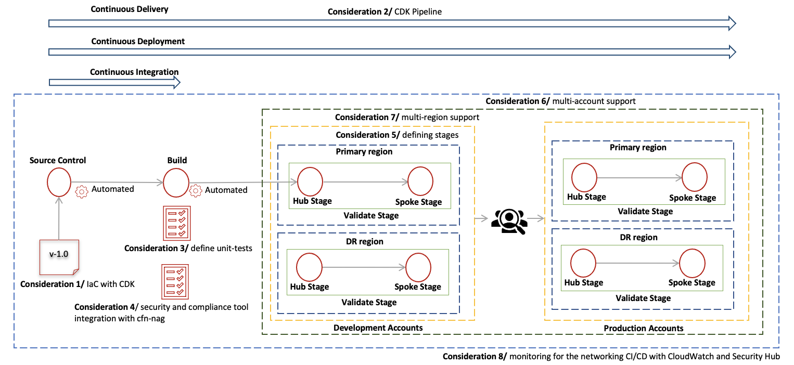

# NetDevOps Multi account Multi Region Pipeline

The purpose of this repository is to demo how can we deploy a NetDevOps Multi account Multi Region Pipeline as part of the NetDevops: A modern approach to AWS Networking Deployment, part two Blog.

## Architecture

## 

## Pre-requisites

To deploy the infrastructure, following are the prerequisites required:

1. Five [AWS Identity and Access Management](https://aws.amazon.com/iam/) (IAM) accounts as part of [AWS Organizations](https://aws.amazon.com/organizations/) with administrator privileges for the services used in this solution.
    a. Development Account – Used to provision the NetDevOps Pipeline
    b. Dev Hub Account – NetDevOps Pipeline provisions the Dev Hub Workload
    c. Dev Spoke Account – NetDevOps Pipeline provisions the Dev Spoke Workload
    d. Prod Hub Account – NetDevOps Pipeline provisions the Prod Hub Workload
    e. Prod Spoke Account – NetDevOps Pipeline provisions the Prod Spoke Workload
2. Turn on trusted access for [AWS Resource Access Manager](https://aws.amazon.com/ram/) (AWS RAM) in the Organizations Management Account. Review these steps to activate it.
3. Turn on the Delegated administrator account for [Security Hub](https://docs.aws.amazon.com/securityhub/latest/userguide/securityhub-settingup.html) in the Organizations Management Account. Review these [steps](https://docs.aws.amazon.com/organizations/latest/userguide/services-that-can-integrate-securityhub.html#integrate-enable-da-securityhub) to activate it.
4. Configure the AWS credentials of the Development account in the terminal. [Install](https://docs.aws.amazon.com/cdk/v2/guide/getting_started.html) the AWS CDK Toolkit. If you’re unfamiliar with the steps, then review the AWS [CDK workshop](https://cdkworkshop.com/15-prerequisites/500-toolkit.html) for help

## Deployment Steps

The example setup assumes an AWS deployment account that has access to Network Hub account and workload accounts of development and production environments part of the same AWS Organizations. The deployment consists of two CDK applications:

1. NetDevops foundations application  - This CDK app provisions all the pre-requisites that will be used as part of the NetDevops pipeline which includes the [AWS Code commit](https://aws.amazon.com/codecommit/) Repository, Cross account IAM role, [SNS](https://aws.amazon.com/sns/) Topic and Lambda function used to send cfn-nag findings. .
2. NetDevops pipeline application - This CDK app provisions the Infrastructure pipeline with all the stages to provision resources in Hub and Spoke account in the Primary and DR region.

### NetDevops Foundations Application

1. Clone the repository and bootstrap the application in your local machine by running the following CLI commands from a terminal window.

```
git clone <repo url> NetDevopsPipeline
cd NetDevopsPipeline
python3 -m venv .venv
source .venv/bin/activate
python3 -m pip install -r requirements.txt
```

2. Update the accounts.py in the NetDevopsPipeline folder with Developement, Hub and spoke accounts in Development and Production environment.

3. Update the cdk.json with your email to receive SNS notification , Organizations ID and then deploy the *NetDevops Foundations Application*

```
cdk bootstrap aws://<Development account id>/<Development Region>
cdk deploy -c infra_type=NetDevopsFoundation --require-approval=never
```

### NetDevops Pipeline Application

1. Clone the  AWS CodeCommit repository (network-devops-repo) that is created in previous step.

```
git remote add codecommit https://git-codecommit.<Development account Region>.amazonaws.com/v1/repos/network-devops-repo
```

***NOTE:*** The above steps requires setting up Https git credentials. Review the [steps](https://docs.aws.amazon.com/codecommit/latest/userguide/setting-up-gc.html) to setup git credentials. Due to operational reason if you’re unable to setup git credentials then follow the
steps mentioned [here](https://docs.aws.amazon.com/codecommit/latest/userguide/setting-up-git-remote-codecommit.html#setting-up-git-remote-codecommit-prereq) for git-remote-codecommit setup.

2. Add the code to the repository by running the following commands

```
git add .
git commit -m "Initial NetDevops pipeline repo commit"
git push --set-upstream codecommit main
```

3. Bootstrap the hub account and spoke account in development and production environment by following the below steps or, alternatively the accounts can bootstrap the accounts using StackSet, following the steps
highlighted in this [post](https://aws.amazon.com/blogs/mt/bootstrapping-multiple-aws-accounts-for-aws-cdk-using-cloudformation-stacksets/).

```
Hub Account [Development Environment] 

cdk bootstrap aws://<Hub account id>/<Primary Region> —trust <Development account> --cloudformation-execution-policies arn:aws:iam::aws:policy/AdministratorAccess 
cdk bootstrap aws://<Hub account id>/<DR Region> —trust <Development account> --cloudformation-execution-policies arn:aws:iam::aws:policy/AdministratorAccess 

Spoke Account [Development Environment]
 
cdk bootstrap aws://<Spoke account id>/<Primary Region> —trust <Development account> --cloudformation-execution-policies arn:aws:iam::aws:policy/AdministratorAccess 
cdk bootstrap aws://<Spoke account id>/<DR Region> --trust <Development account> —cloudformation-execution-policies arn:aws:iam::aws:policy/AdministratorAccess

Hub Account [Production Environment] 

cdk bootstrap aws://<Hub account id>/<Primary Region> —trust <Development account> --cloudformation-execution-policies arn:aws:iam::aws:policy/AdministratorAccess 
cdk bootstrap aws://<Hub account id>/<DR Region> —trust <Development account> --cloudformation-execution-policies arn:aws:iam::aws:policy/AdministratorAccess 

Spoke Account [Production Environment]
 
cdk bootstrap aws://<Spoke account id>/<Primary Region> —trust <Development account> --cloudformation-execution-policies arn:aws:iam::aws:policy/AdministratorAccess 
cdk bootstrap aws://<Spoke account id>/<DR Region> --trust <Development account> —cloudformation-execution-policies arn:aws:iam::aws:policy/AdministratorAccess
```

NOTE: Make sure the correct IAM account credentials are setup during the BootStrapping of each environment.

4. Provision the pipeline by running the following command. The deployment of NetdevOps pipeline with all the stages is shown in figure

```
cdk deploy --all --require-approval=never
```

Note : The deployment takes around 10-15 minutes due the AWS CodePipelines and CloudFormation template creation. Check the progress on the CodePipeline [AWS CodePipeline Console](https://console.aws.amazon.com/codepipeline/) on your Hub account Primary region.

5. The NetDevOps pipeline has an manual approval stage to validate the hub and spoke connectivity. When the status from [VPC Reachability Analyzer](https://docs.aws.amazon.com/vpc/latest/reachability/what-is-reachability-analyzer.html) is reachable, [SNS](https://aws.amazon.com/sns/) notification is sent. Review this notification and approve the Manual stage for resources to be provisioned in the Production environment.

## Clean up

To avoid unnecessary charges, delete the resources created during the deployment of NetDevOps pipeline and testing. To perform a cleanup of the resources, perform the following steps in the sequential order defined here :

1. The stacks created by the CodePipeline should deleted manually from CloudFormation console. Hence, identify the appropriate stacks, and delete them in hub and spoke accounts in both primary and DR region for production and development environment. Also delete the s3 bucket.
2. Destroy the NetDevops Foundations and NetDevops Pipeline Applications run the below commands

```
cdk destroy --all
cdk destroy -c infra_type=NetDevopsFoundation
```

## Conclusion

NetDevOps lets you deliver applications and services at high velocity. This means faster changes and a reduced network delivery lifecycle. In this blog, we demonstrated how to implement NetDevOps in practice leveraging CDK. We also showed how you can include security and compliance requirements as part of your network CI/CD. We removed the undifferentiated heavy lifting for setting up CI/CD pipeline by providing templates to provision the infrastructure required. We hope that you’ve found this post informative and we look forward to hearing how you use this new feature!
